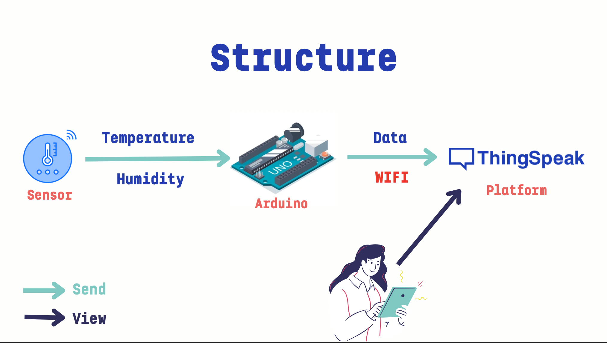
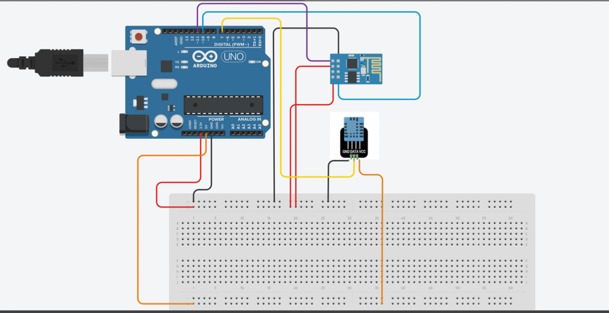
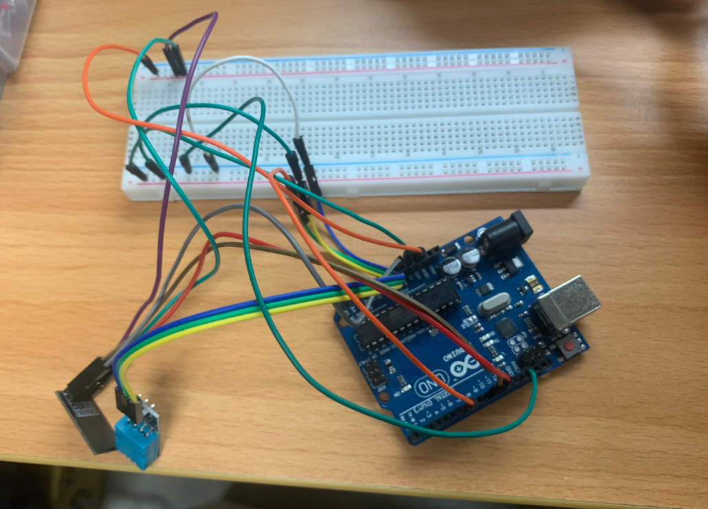
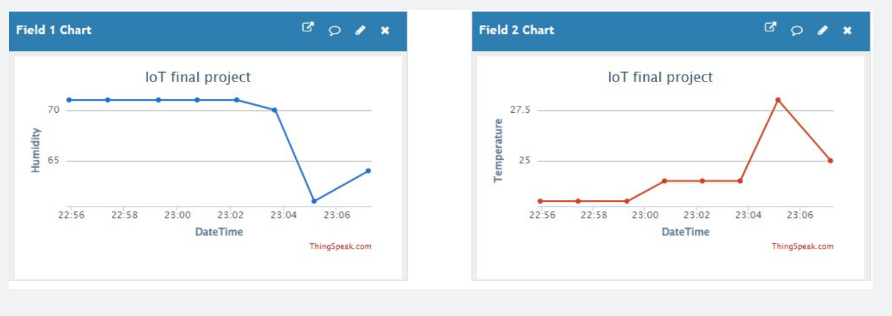

# IoT
An IoT project that combines Arduino and the Thingspeak platform.

---
## Structure

---
## Requirements

Before you begin, ensure you have the following hardware components:

- DH11 sensor
- Arduino board
- ESP8266 module
- ThingSpeak Platform

Additionally, make sure you already have a ThingSpeak account and a project.

---
## Design Diagram

---
## Design Diagram Showcase

---
## Demo
- #### Chart

- #### Video
Please refer to this [video](https://drive.google.com/file/d/11gAn0d3NQb_Z5mGbMr_im0AGB6TwEnMO/view)
